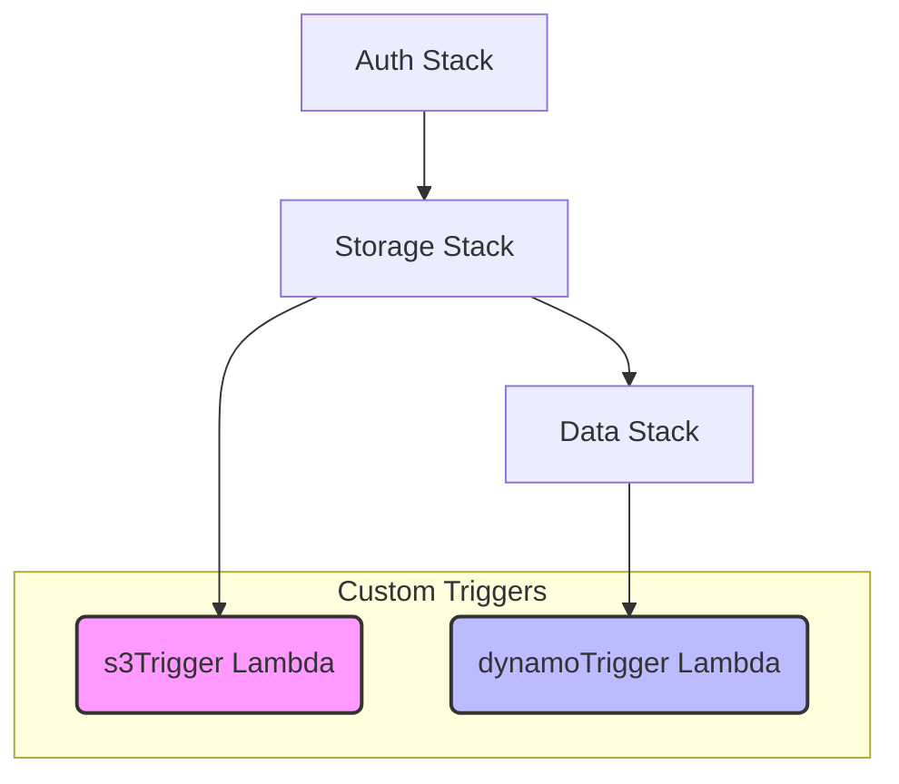
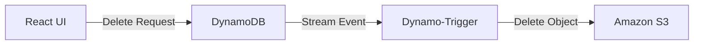
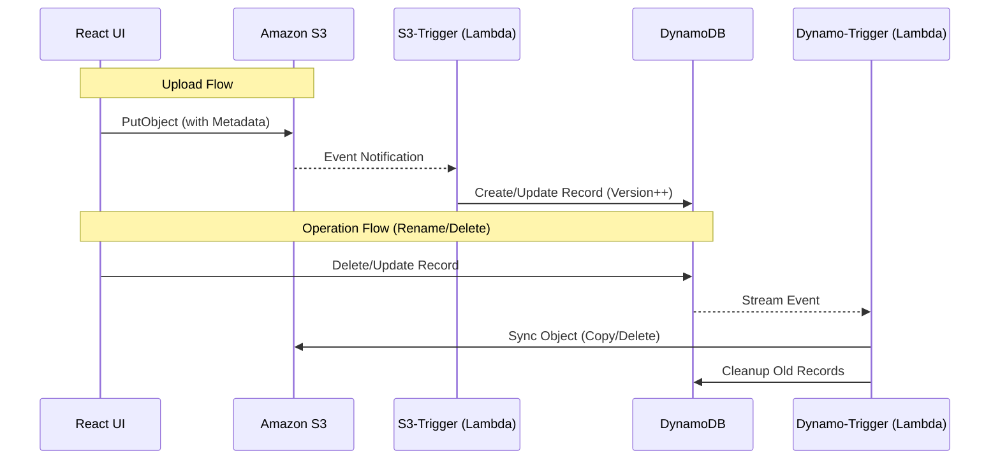

# Welcome to My Backend Dropbox
***

## Task

Building a serverless, production-ready file storage system similar to Dropbox presents several key challenges:

**The Problems:**
- Managing secure file uploads and storage at scale without maintaining servers
- Implementing bidirectional synchronization between S3 (file storage) and DynamoDB (metadata) with automatic triggers
- Creating a folder hierarchy system that mimics traditional file systems in a cloud-native architecture
- Handling file versioning when the same file is uploaded multiple times
- Implementing file rename operations that automatically replicate files in S3 and clean up old locations
- Building a responsive frontend with folder navigation, breadcrumbs, and real-time updates
- Creating a fully serverless architecture that costs $0 under AWS Free Tier
- Configuring DynamoDB Streams and S3 Event Notifications without creating stack circular dependencies
- **Account Cleanup**: Implementing a secure "Deep Purge" flow that wipes all user data before account deletion

## Description

### Production Deployment At:

**Live Application:**
- **Primary URL:** https://mydropbox.saberlabs.dev
- **Amplify Default:** https://main.d2st7dsfis69v2.amplifyapp.com

**How the Problem Was Solved:**

### Architecture Overview
This project implements a **serverless Dropbox clone** using **AWS Amplify Gen 2** with a sophisticated **dual-trigger architecture** that keeps S3 and DynamoDB perfectly synchronized in both directions.

### Backend Solution (AWS Infrastructure)

**1. Authentication (AWS Cognito)**
- Email-based user authentication with sign-up confirmation
- Username attributes disabled (`cfnUserPool.usernameAttributes = []`)
- Automatic user isolation using Cognito Identity IDs
- Optional preferred username support (mutable, not required)

**2. File Storage (Amazon S3)**
- Direct file uploads from frontend to S3 bucket
- User-specific folders with custom metadata (owner, folderId)
- Files stored with full path as key: `user-files/{userId}/{folder}/{filename}`
- S3 object metadata stores:
  - `owner`: Cognito user ID for authorization
  - `folderid`: Parent folder ID for hierarchy tracking

**3. Metadata Storage (Amazon DynamoDB)**
- GraphQL API auto-generated from schema using Amplify Data
- Two tables:
  - **FileMetadata**: Stores file info (name, size, S3 key, MIME type, folder path, version, soft delete flag)
  - **Folder**: Stores folder structure (name, path, parent folder ID, size)
- Owner-based authorization ensures users only see their own data
- DynamoDB Streams enabled for real-time change detection
- Versioning support: tracks file version numbers (increments on overwrite)

**4. Dual-Trigger Lambda Architecture**

This is the **key innovation** - two Lambda functions working in tandem to maintain perfect synchronization:

**a. s3-trigger-handler (S3 → DynamoDB Sync)**
- **Trigger**: S3 Event Notification on `ObjectCreated`
- **Flow**: S3 Upload → Lambda → DynamoDB Write
- **Purpose**: Automatically create/update metadata when files are uploaded
- **Assigned to**: `storage` stack (via `resourceGroupName`)
- **Timeout**: 60 seconds

**What it does:**
1. Listens for file uploads to S3 bucket
2. Extracts file information (key, size, bucket)
3. Parses folder structure from S3 key path
4. Fetches S3 object metadata using `HeadObjectCommand` to get:
   - `owner`: User who uploaded the file
   - `folderid`: Destination folder ID
5. Checks if file already exists in DynamoDB (for versioning)
6. If exists: increments version number (`version++`)
7. If new: sets version to 1
8. Creates/updates DynamoDB record with:
   - File metadata (name, size, path)
   - Owner information (for authorization)
   - Folder context (path, ID)
   - Versioning info
   - Timestamps (createdAt, updatedAt, lastModified)

**Key Features:**
- **Automatic versioning**: Detects overwrites and increments version
- **Owner extraction**: Reads from S3 metadata for proper authorization
- **Folder detection**: Determines if file is in root or nested folder
- **Error resilient**: Handles missing metadata gracefully with fallbacks

**b. dynamo-trigger-handler (DynamoDB → S3 Sync)**
- **Trigger**: DynamoDB Streams on `MODIFY` and `REMOVE` events
- **Flow**: DynamoDB Change → Lambda → S3 Operations
- **Purpose**: Sync file renames, and deletions back to S3
- **Assigned to**: Default stack (no resourceGroupName)
- **Timeout**: 60 seconds

**What it does:**

**On REMOVE (Delete):**
1. Detects when file metadata is deleted from DynamoDB
2. Extracts `s3Key` from the old record
3. Deletes corresponding file from S3 bucket
4. Ensures orphaned files don't remain in S3

**On MODIFY (Rename):**
1. Detects changes to `fileName` or `s3Key` fields
2. Compares old and new values to identify rename operations
3. If detected:
   - Calculates new S3 key from `folderPath` + `fileName`
   - Copies file to new location using `CopyObjectCommand` (preserves metadata)
   - Deletes file from old location using `DeleteObjectCommand`
   - Deletes old DynamoDB record to prevent duplicates
4. Handles false alarms (no effective key change) by skipping

**Key Features:**
- **Smart rename detection**: Compares old vs new values to detect actual changes
- **Metadata preservation**: S3 copy preserves all object metadata
- **Atomic operations**: Copy → Delete → Cleanup pattern ensures consistency
- **Duplicate prevention**: Deletes old DynamoDB records after migration

**5. Stack Organization & Circular Dependency Resolution**

The project carefully manages resource dependencies:



**Key Decisions:**
- `s3Trigger` assigned to `storage` stack to avoid circular dependency
- `dynamoTrigger` uses default stack placement
- Storage bucket created in `storage` resource
- DynamoDB table created in `data` resource
- Lambdas get environment variables pointing to resources
- Permissions granted explicitly via CDK methods

**Permissions Matrix:**
```
s3Trigger Lambda:
  ✓ Read S3 objects (HeadObject for metadata)
  ✓ Write to DynamoDB (PutCommand)
  ✓ Read from DynamoDB (GetCommand for versioning)

dynamoTrigger Lambda:
  ✓ Read/Write S3 (Copy, Delete)
  ✓ Read DynamoDB Streams (automatic via EventSource)
  ✓ Write to DynamoDB (DeleteCommand for cleanup)
```

**5. Continuous Deployment (AWS Amplify Gen2 Hosting)**
- Git-based deployment with automatic CI/CD pipeline
- Connected to GitHub repository for automatic builds on push
- Branch: `main` triggers production deployments

**6. Custom Domain Configuration (Amazon Route 53)**
- Primary domain: `https://mydropbox.saberlabs.dev`
- DNS managed through Amazon Route 53
- SSL/TLS certificate automatically provisioned via AWS Certificate Manager (ACM)
- HTTPS enforced with automatic HTTP → HTTPS redirect
- CDN distribution via Amazon CloudFront for global low-latency access

### Frontend Solution (React + TypeScript)

- Create new folders at any level
- Upload files to current folder context

**2. File Operations**
- **Upload**: 
  - Drag & drop or click to select multiple files
  - Files uploaded with S3 metadata (owner, folderId)
  - S3 trigger automatically creates DynamoDB metadata
  - Version incremented if file already exists
- **Download**: 
  - One-click download with pre-signed S3 URLs (15-minute expiration)
- **Rename**: 
  - Inline editing updates DynamoDB record
  - DynamoDB trigger detects change
  - Lambda copies file in S3 to new name
  - Old file and metadata automatically cleaned up
- **Delete**: 
  - Confirmation dialog
  - Deletes DynamoDB record
  - DynamoDB trigger detects removal
  - Lambda deletes file from S3

**3. Versioning Display**
- Shows current version number for each file
- Version history tracking
- Last modified timestamp
- Soft delete flag for potential recovery

**4. Type Safety**
- Full TypeScript implementation
- Auto-generated types from Amplify schema
- Type-safe GraphQL queries and mutations
- IntelliSense support for all operations

- **S3 Orphan Prevention**: Automatic Lambda trigger ensures physical files are removed after DB cleanup.
- **Shared Links**: Secure file sharing with password protection and expiration dates.
- **File Previews**: Built-in preview for images, videos, audio, PDF, and code files.
- **User Profile**: Manage account settings, view real-time storage usage, and update avatar.

**6. Premium UI/UX & Immersive Experience**
- **Modern Application Shell**: A professional sidebar-based layout with a fixed navigation rail and a sticky, contextual top bar.
- **Immersive Login Animation**: 
  - **Parallax Clouds**: Layered, drifting clouds with randomized speeds and opacities for a deep atmospheric background.
  - **Animated Brand Logo**: The application favicon acts as an ascending/floating parachute in the login and sign-up headers.
  - **Glassmorphism**: Transparent authentication forms and blurred overlays for a sleek, high-end feel.
- **Professional Navigation**: 
  - **Interactive Breadcrumbs**: Scrollable path navigation with a smooth fade-out effect for deep folder structures.
  - **Contextual User Menu**: A dedicated header component with a toggled dropdown for account management.
- **Compact Sign-Up**: Re-engineered form layouts to ensure full visibility within a single viewport, eliminating the need for scrolling during onboarding.
- **Dynamic Feedback**: Lift animations on hover for file cards, version badges, and smooth state transitions.

### Key Technical Decisions

**Why Dual-Trigger Architecture?**
- **S3 → DynamoDB**: Handles direct uploads (e.g., via AWS SDK, CLI, Console)
- **DynamoDB → S3**: Handles application-driven changes (rename, delete)
- Ensures eventual consistency regardless of entry point
- Decouples frontend from complex file operations
- No frontend polling or manual synchronization needed

**Why DynamoDB Streams Instead of Direct Lambda Invocation?**
- Event-driven, automatic triggers
- Guaranteed delivery of change events
- Scales infinitely without frontend coordination
- Built-in retry logic for failed operations
- Maintains audit trail via CloudWatch logs

**Why Store Owner in S3 Metadata?**
- Enables authorization even when DynamoDB is out of sync
- Allows S3 trigger to correctly assign ownership
- Supports future direct S3 access patterns
- Provides redundancy for critical security information

**Why Amplify Gen 2?**
- Code-first configuration (no CLI prompts)
- Automatic GraphQL API generation from schema
- Built-in type safety with TypeScript
- Faster development iteration with sandbox mode
- Modern developer experience with CDK integration

### Data Flow Examples

**Upload Flow:**
```
1. User selects file in React UI
2. Frontend uploads to S3 with metadata: { owner: userId, folderid: currentFolderId }
3. S3 triggers s3-trigger-handler Lambda
4. Lambda:
   - Fetches S3 object metadata (owner, folderid)
   - Checks DynamoDB for existing file (versioning)
   - Creates/updates DynamoDB record with version++
5. Frontend refreshes and displays new file
```

**Rename Flow:**
```
1. User renames file in React UI
2. Frontend updates DynamoDB record (fileName + s3Key changed)
3. DynamoDB Stream triggers dynamo-trigger-handler Lambda
4. Lambda:
   - Detects fileName/s3Key modification
   - Copies S3 object to new key (preserves metadata)
   - Deletes old S3 object
   - Deletes old DynamoDB record (prevents duplicates)
5. Frontend shows renamed file
```

**Delete Flow (Standard):**


**Account Deletion Flow (Deep Purge):**

```mermaid
sequenceDiagram
    participant User as React UI
    participant DB as DynamoDB
    participant DBL as Dynamo-Trigger
    participant S3 as Amazon S3
    participant Auth as Cognito

    User->>User: Confirmation Dialog
    User->>User: Show "Purging Data" Overlay
    rect rgb(40, 44, 52)
        Note right of User: Loop through all metadata
        User->>DB: Delete individual FileMetadata
        DB-->>DBL: Stream (REMOVE)
        DBL->>S3: Delete Physical File
    end
    User->>Auth: DeleteUser Account
    Note over User, Auth: Account Closed & Data Cleaned
```


### Technology Stack
- **Frontend**: React 19, TypeScript, AWS Amplify v6, Lucide-React, FontAwesome, CSS3 Keyframe Animations
- **Backend**: AWS Amplify Gen 2 (Amplify Gen2 / CDK), Node.js 24+
- **Storage**: Amazon S3 with Event Notifications
- **Database**: Amazon DynamoDB with Streams
- **Compute**: AWS Lambda (Node.js runtime)
- **API**: AWS AppSync (GraphQL)
- **Authentication**: Amazon Cognito User Pools
- **IaC**: AWS CDK (via Amplify Gen 2)
- **SDK**: AWS SDK v3 (@aws-sdk/client-s3, @aws-sdk/client-dynamodb, @aws-sdk/lib-dynamodb)

## Installation

### Prerequisites
```bash
# Node.js 24 or higher
node --version  # Should output v24.x.x or higher

### Step 1: Clone this repository

git clone https://github.com/devbossma/my-dropbox.git

cd my-dropbox

# Initialize Amplify Gen 2
npm create amplify@latest
```

### Step 2: Install Dependencies
```bash
# Core dependencies
npm install
```

### Step 3: Install AWS CDK (if not installed)
```bash
npm install -g aws-cdk

# Verify installation
cdk --version
```

### Step 4: Bootstrap AWS Account (One-time setup)
```bash
# Get your AWS account ID
aws sts get-caller-identity

# Bootstrap CDK (replace with your account ID and region)
cdk bootstrap aws://YOUR_ACCOUNT_ID/us-east-1

# Or let CDK auto-detect
cdk bootstrap
```

### Step 5: Configure Backend

**Create backend configuration files:**
```bash
# Backend structure
amplify/
├── auth/
│   └── resource.ts              # Cognito configuration
├── data/
│   └── resource.ts              # DynamoDB schema (FileMetadata, Folder)
├── storage/
│   └── resource.ts              # S3 bucket configuration
├── functions/
│   ├── s3-trigger/
│   │   ├── handler.ts           # S3 → DynamoDB sync
│   │   └──  resource.ts  
│   │                           # Lambda config (storage stack)
│   └── dynamo-trigger/
│       ├── handler.ts           # DynamoDB → S3 sync
│       └──  resource.ts
└── backend.ts                   # Main backend + trigger wiring
```

**Key Configuration Points:**

**backend.ts:**
- Imports all resources (auth, data, storage, triggers)
- Disables username attributes: `cfnUserPool.usernameAttributes = []`
- Wires S3 Event Notification → s3Trigger Lambda
- Wires DynamoDB Stream → dynamoTrigger Lambda
- Grants permissions between services
- Sets environment variables (TABLE_NAME, BUCKET_NAME)

**data/resource.ts:**
- Defines FileMetadata model with versioning and soft delete
- Defines Folder model with size tracking
- Sets owner-based authorization
- UserPool as default auth mode

**storage/resource.ts:**
- Defines S3 bucket with access patterns
- Configures CORS for browser uploads

**functions/s3-trigger/resource.ts:**
- Assigned to `storage` stack via `resourceGroupName`
- 60-second timeout

**functions/dynamo-trigger/resource.ts:**
- Default stack assignment
- 60-second timeout

### Step 6: Deploy Backend
```bash
# Start Amplify sandbox (deploys to AWS and watches for changes)
npx ampx sandbox

# Wait for deployment (10-15 minutes first time)
# You should see:
# ✅ Auth deployed
# ✅ Storage deployed  
# ✅ Data deployed
# ✅ s3Trigger deployed
# ✅ dynamoTrigger deployed
# ✅ S3 event notification configured
# ✅ DynamoDB stream configured
```

### Step 7: Start Frontend
```bash
# In a new terminal (keep sandbox running)
npm run dev

# App opens at http://localhost:${PORT}
```
### Step 8: Deploy to Production (Optional)

**Deploy via Amplify Hosting + Git**
```bash
# 1. Push your code to GitHub
git init
git add .
git commit -m "Initial commit"
git branch -M main
git remote add origin https://github.com/YOUR_USERNAME/YOUR_REPO.git
git push -u origin main

# 2. Connect to Amplify Hosting
# - Go to AWS Amplify Console: https://console.aws.amazon.com/amplify/
# - Click "New app" → "Host web app"
# - Select "GitHub" as source
# - Authorize AWS Amplify to access your repository
# - Select your repository and branch (main)
# - Amplify auto-detects build settings from amplify.yml
# - Click "Save and deploy"

# 3. Wait for deployment (5-10 minutes)
# You'll get a URL like: https://main.d1a2b3c4.amplifyapp.com
```

**Configure Custom Domain (Route 53)**
```bash
# Prerequisites:
# - Own a domain (e.g., saberlabs.dev)
# - Domain DNS hosted in Route 53 (or transferable)

# Steps:
1. Go to Amplify Console → Your App → Domain management
2. Click "Add domain"
3. Select your Route 53 hosted zone: saberlabs.dev
4. Add subdomain: mydropbox.saberlabs.dev
5. Amplify automatically:
   - Requests SSL/TLS certificate from ACM
   - Creates Route 53 DNS records (A/AAAA for CloudFront)
   - Configures CloudFront distribution
6. Wait for DNS propagation (5-30 minutes)
7. Access your app at: https://mydropbox.saberlabs.dev
```

## Usage

### Starting the Application

**For Local Development:**
```bash
# Terminal 1: Backend sandbox (keep running)
npx ampx sandbox

# Terminal 2: Frontend development server
npm run dev

# App opens at http://localhost:${PORT}
```

**For Production:**
```bash
# Access the deployed application
https://mydropbox.saberlabs.dev

# Or via Amplify default domain
https://main.d2st7dsfis69v2.amplifyapp.com
```

### Basic Workflow

**1. Authentication**
```
# First-time users
1. Click "Need an account? Sign Up"
2. Enter email and password
3. Check email for confirmation code
4. Enter code and sign in

# Returning users
1. Enter email and password
2. Click "Sign In"
```

**2. Upload Files with Metadata**
```bash
# Frontend automatically adds S3 metadata during upload:
- owner: <cognito-user-id>
- folderid: <current-folder-id>

# What happens:
1. File uploaded to S3: user-files/{userId}/{folder}/{filename}
2. S3 triggers s3-trigger-handler Lambda
3. Lambda reads metadata from S3 object
4. Lambda checks for existing file (versioning)
5. Lambda creates/updates DynamoDB record with version++
6. Frontend auto-refreshes and shows file
```

**3. Create Folders**
```bash
1. Click "📁 New Folder" button
2. Enter folder name
3. Press Enter or click "Create"

# Folder hierarchy: /Documents/Photos/Vacation
# Each folder gets a unique ID in DynamoDB
```

**4. Navigate Folders**
```bash
# Method 1: Double-click folder
- Double-click any folder card to open it

# Method 2: Breadcrumb navigation
- Click any folder in breadcrumb: Home > Documents > Photos
- Jump to any parent folder instantly
```

**5. Rename Files (Automatic S3 Migration)**
```bash
1. Click pencil (✎) icon on file
2. Type new filename
3. Press Enter

# What happens:
1. Frontend updates DynamoDB: fileName="new.txt", s3Key="user-files/{userId}/{folder}/new.txt"
2. DynamoDB Stream triggers dynamo-trigger-handler Lambda
3. Lambda detects fileName modification
4. Lambda copies S3 object: old-key → new-key (preserves metadata)
5. Lambda deletes old S3 object
6. Lambda deletes old DynamoDB record
7. Result: File renamed in both S3 and DynamoDB
```

**6. Delete Files (Automatic S3 Cleanup)**
```bash
1. Click delete (✕) icon on file
2. Confirm deletion

# What happens:
1. Frontend deletes DynamoDB record
2. DynamoDB Stream triggers dynamo-trigger-handler Lambda (REMOVE event)
3. Lambda extracts s3Key from deleted record
4. Lambda deletes file from S3
5. Result: File removed from both systems
```

**8. View File Versions**
```bash
# Each file shows current version number
# Version increments when same file uploaded again
# lastModified timestamp tracks latest change
```

**9. Download Files**
```bash
1. Click download (↓) icon on file
2. File downloads to your default download folder

# Uses pre-signed S3 URLs (valid for 15 minutes)
```

**10. Delete Your Account**
```
1. Click on the Delete Account button.
2. Confirm that you want to delete your data.
3. Please wait patiently while your data is being completely removed.
4. Once done, you'll be automatically redirected to the Login page.
```

### Command Reference
```bash
# Development
npm run dev                       # Start frontend dev server
npx ampx sandbox or npx ampx sandbox --profile dev              # Start backend sandbox (auto-deploys on changes)

# Deployment
npx ampx sandbox delete        # Delete sandbox resources
npm run build                  # Build frontend for production

# Debugging
npx ampx sandbox --help        # Show sandbox options
cdk doctor                     # Check CDK configuration

# View Lambda logs (in AWS Console)
# CloudWatch → Log Groups → /aws/lambda/s3-trigger-handler-...
# CloudWatch → Log Groups → /aws/lambda/dynamo-trigger-handler-...

# Check DynamoDB Stream
# DynamoDB Console → Tables → FileMetadata → Exports and streams

# Check S3 Event Notifications
# S3 Console → Bucket → Properties → Event notifications
```

### Project Structure
```
my-dropbox/
├── amplify/                          # Backend (Amplify Gen 2)
│   ├── auth/
│   │   └── resource.ts              # Cognito configuration
│   ├── data/
│   │   └── resource.ts              # DynamoDB Schema
│   ├── storage/
│   │   └── resource.ts              # S3 Configuration
│   ├── functions/
│   │   ├── s3-trigger/              # S3 -> DB logic
│   │   └── dynamo-trigger/          # DB -> S3 logic
│   └── backend.ts                   # Infrastructure Wiring
├── src/
│   ├── assets/                      # Brand logo and animation SVGs
│   ├── components/
│   │   ├── FileExplorer/            # Icon-based file browser
│   │   ├── FileManager/             # Core state management
│   │   ├── FilePreview/             # File Preview Modal
│   │   ├── FileUploader/            # Drag & Drop uploads
│   │   ├── Header/                  # Top bar with User Menu
│   │   ├── Login/                   # Immersive background animation
│   │   ├── Profile/                 # User Profile & Settings
│   │   ├── Share/                   # Shared Links & Password Protection
│   │   ├── Sidebar/                 # Navigation & Storage monitor
│   │   └── Toast/                   # Notification system
│   ├── utils/
│   │   ├── folderOperations.ts      # Recursive Rename/Delete
│   │   ├── profileUtils.ts          # Profile Management
│   │   └── storageUtils.ts          # Storage Calculations
│   ├── App.tsx                      # Root component & Application Shell
│   ├── App.css                      # Navigation Rail & Top Bar layouts
│   ├── index.css                    # Design Tokens & Global Styles
│   ├── configureAmplify.ts          # Amplify client initialization
│   └── main.tsx                     # Entry point
└── README.md
```

### Environment Variables (Auto-configured)
```bash
# s3-trigger Lambda receives:
TABLE_NAME=FileMetadata-...            # DynamoDB table name

# dynamo-trigger Lambda receives:
BUCKET_NAME=dropboxfiles-...           # S3 bucket name
TABLE_NAME=FileMetadata-...            # DynamoDB table name

# Both receive automatically:
AWS_REGION=us-east-1                   # Deployment region
```

### Data Flow Visualization



### Cost Estimate

**AWS Free Tier (12 months):**
- Cognito: 50,000 MAUs → $0
- S3: 5GB storage, 20,000 GET, 2,000 PUT → $0
- DynamoDB: 25GB storage, 25 RCU/WCU → $0
- Lambda: 1M requests/month, 400,000 GB-seconds → $0
- AppSync: 250,000 queries/month → $0
- DynamoDB Streams: 2.5M stream reads/month → $0
- S3 Event Notifications: Free

**Monthly cost for typical personal use: $0**

### Testing Checklist
```bash
✅ Sign up new user
✅ Confirm email
✅ Sign in
✅ Create folder
✅ Navigate into folder
✅ Upload file to folder
  ├─ Check S3 object has metadata (owner, folderid)
  ├─ Check DynamoDB record created automatically
  └─ Verify version = 1
✅ Upload same file again
  └─ Verify version increments to 2
✅ Download file
✅ Rename file
  ├─ Check new file exists in S3
  ├─ Check old file deleted from S3
  └─ Check old DynamoDB record deleted
✅ Delete file
  ├─ Check DynamoDB record deleted
  └─ Check S3 file removed automatically
✅ Delete empty folder
✅ UI: Verify login background animation is smooth
✅ UI: Verify logo ascends in header
✅ UI: Verify breadcrumbs scroll horizontally on narrow screens
✅ UI: Verify user menu toggles correctly
✅ UI: Ensure sign-up form fits in viewport
✅ Sign out and sign back in
✅ Verify data persistence
✅ Check CloudWatch logs for both Lambdas
```

### Troubleshooting

**Sandbox won't start:**
```bash
# Re-bootstrap CDK
cdk bootstrap --force

# Clear cache
rm -rf .amplify node_modules
npm install
npx ampx sandbox
```

**Files uploaded but no metadata in DynamoDB:**
```bash
# Check S3 event notification is configured
# AWS Console → S3 → Bucket → Properties → Event notifications
# Should see: ObjectCreated:* → s3-trigger-handler Lambda

# Check Lambda logs
# CloudWatch → /aws/lambda/s3-trigger-handler-...
# Look for errors or missing environment variables

# Verify TABLE_NAME environment variable is set in Lambda
```

**Rename not working (old file remains):**
```bash
# Check DynamoDB Stream is enabled
# DynamoDB Console → FileMetadata → Exports and streams → DynamoDB stream details

# Check Lambda trigger is connected
# Lambda Console → dynamo-trigger-handler → Configuration → Triggers
# Should see: DynamoDB trigger on FileMetadata table

# Check Lambda logs for errors
# CloudWatch → /aws/lambda/dynamo-trigger-handler-...
```

**Delete removes DynamoDB but S3 file remains:**
```bash
# Same checks as rename issue above
# Verify dynamo-trigger Lambda has S3 delete permissions
# Check logs for permission errors
```

**Version not incrementing:**
```bash
# Check s3-trigger Lambda has GetCommand permission on DynamoDB
# Verify version logic in handler.ts:
#   - Checks for existing item
#   - Increments version if found
#   - Sets version = 1 if not found
```

**Circular dependency error:**
```bash
# Verify s3-trigger has: resourceGroupName: 'storage'
# Verify dynamo-trigger has NO resourceGroupName
# Check backend.ts doesn't create circular resource references
```

**Owner field shows "unknown":**
```bash
# Ensure frontend sets S3 metadata during upload:
#   metadata: { owner: currentUserId, folderid: currentFolderId }
# Check s3-trigger Lambda successfully reads HeadObject metadata
# Verify metadata keys are lowercase in S3 (automatic)
```

***

**Built with AWS Amplify Gen 2, React, TypeScript, and ❤️**

**Architecture:** Dual-Trigger Serverless (S3 ⟷ DynamoDB bidirectional sync)

**License:** MIT

**Author:** SABER YASSINE

**Live Demo:** https://mydropbox.saberlabs.dev

**Repository:** https://github.com/devbossma/my-dropbox.git

### The Core Team


<span><i>Made at <a href='https://qwasar.io'>Qwasar SV -- Software Engineering School</a></i></span>
<span></span>
